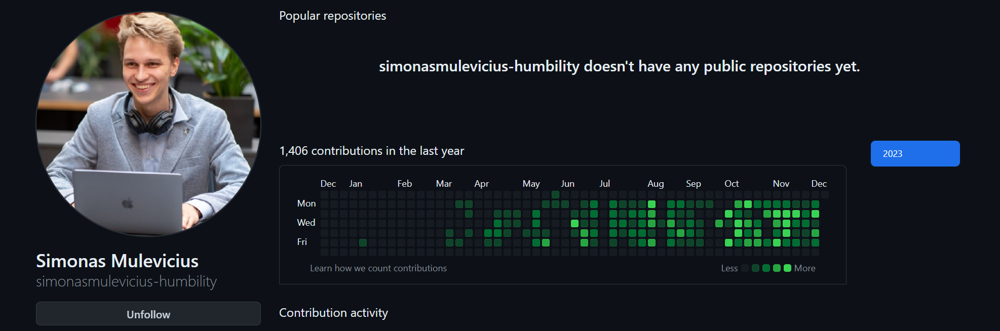
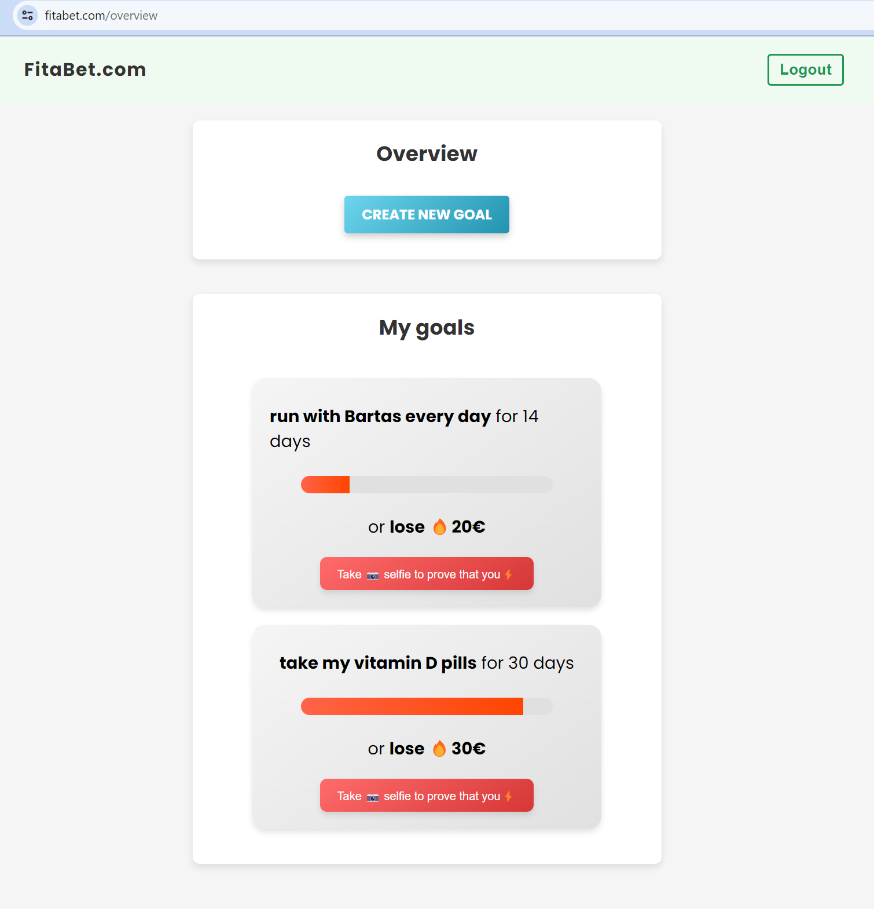

<h1 align="center">Hi 👋, I'm Simon</h1>
<h3 align="center">Creative developer passionate about networks, full-stack solutions and computer graphics</h3>

- ⚡ [Python Developer@Humbility](https://github.com/simonasmulevicius-humbility)

  

- 🥦 [Building a website with Firebase to track health goals](https://fitabet.com/)

  

- 🐶 [Ex-CTO@Opetly](https://github.com/Opetly)
- 📕 [Bachelor Thesis (Analysis of QUIC networking protocol)@Cambridge University](https://github.com/simonasmulevicius/Part-II-Dissertation-document-sm2354)

<h3 align="left">Languages and Tools:</h3>

                  

<h3 align="center">Portfolio of websites I built</h3>

- [Kirpykla lumis](https://kirpyklalumis.lt/)
- [FDG](https://fdg.lt/)
- [Opetly.com](opetly.com)
- [Žaidimų kalvė](https://zaidimukalve.lt/)
